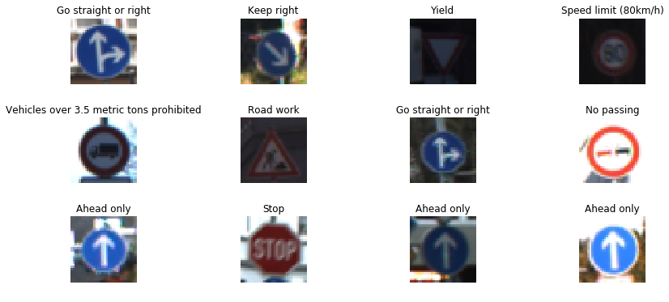
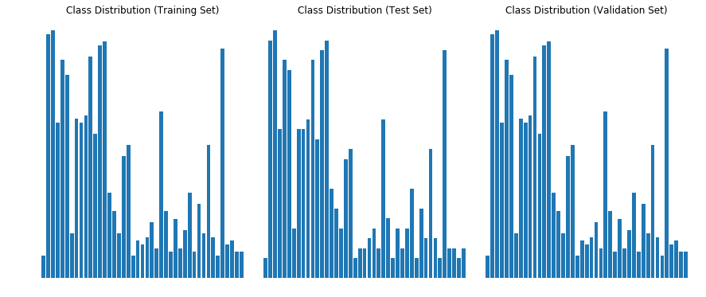
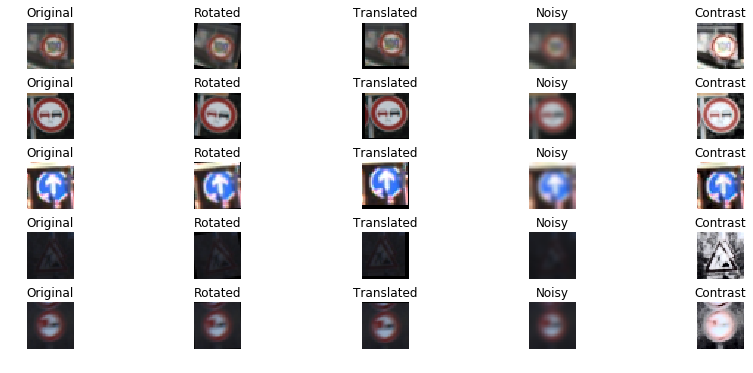
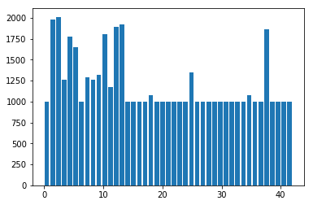
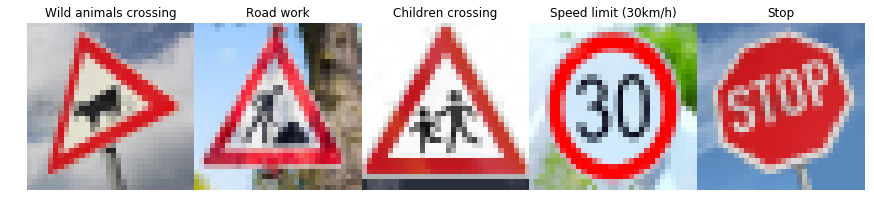
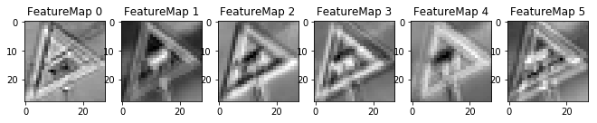
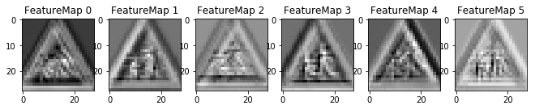

# Self-Driving Car Engineer Nanodegree

## Project: Build a Traffic Sign Recognition Classifier

The goals / steps of this project are the following:
* Load the data set (see below for links to the project data set)
* Explore, summarize and visualize the data set
* Design, train and test a model architecture
* Use the model to make predictions on new images
* Analyze the softmax probabilities of the new images
* Summarize the results with a written report

## Rubric Points
Here I will consider the [rubric points](https://review.udacity.com/#!/rubrics/481/view) individually and describe how I addressed each point in my implementation.  
### Writeup / README
#### 1. Provide a Writeup / README that includes all the rubric points and how you addressed each one. You can submit your writeup as markdown or pdf. You can use this template as a guide for writing the report. The submission includes the project code.

You're reading it! and here is a link to my [project code](https://github.com/nabeelmukhtar/CarND-Traffic-Sign-Classifier-Project/blob/master/Traffic_Sign_Classifier.ipynb)

### Data Set Summary & Exploration
#### 1. Provide a basic summary of the data set. In the code, the analysis should be done using python, numpy and/or pandas methods rather than hardcoding results manually.

The traffic signs data was provided as picked files for training, validation and testing. The pickled data is a dictionary with 4 key/value pairs:

- `'features'` is a 4D array containing raw pixel data of the traffic sign images, (num examples, width, height, channels).
- `'labels'` is a 1D array containing the label/class id of the traffic sign. The file `signnames.csv` contains id -> name mappings for each id.
- `'sizes'` is a list containing tuples, (width, height) representing the original width and height the image.
- `'coords'` is a list containing tuples, (x1, y1, x2, y2) representing coordinates of a bounding box around the sign in the image.

A csv file signnames.csv was also provided to map sign numbers (classes) to specific signs. Here's how I loaded the data. Here is the code loading the data.

I calculated the statistics using simple shape method of numpy arrays. The 0'th element of the shape typle is the size of dataset. For calculating the number of classes I just counted the unique values in the training labels.

    Number of training examples = 34799
    Number of testing examples = 12630
    Number of validation examples = 34799
    Image data shape = (32, 32, 3)
    Number of classes = 43
    

#### 2. Include an exploratory visualization of the dataset.

The first part of the visualization shows a random sample of 12 traffic signs with their names. This is helpful to have a look at the color and quality of the images.

The second part of the visualization shows the distribution of the classes in the training, test and validation datasets. Notice that distribution is identical in all datasets (ignoring the size of the datasets). However there is a huge class imbalance in the dataset as some classes have many more examples than others. This problem is solved later using data augmentation.

----

## Design and Test a Model Architecture

#### 1. Describe how you preprocessed the image data. What techniques were chosen and why did you choose these techniques? 

I used one preprocessing techniques:
* I normalized the image to a range between -0.5 to 0.5

A also tried using grayscale conversion but it did not seem to improve accuracy, so stuck with color images.
Also I had to augment the dataset with additional images because of two reasons: First the model was overfitting on current dataset and second the training data had considerable class imbalance. I decided to generate atleast 1000 images for each class which has less than 1000 samples.
I used the following techniques for generating additional images.

* Rotation.
* Translation.
* Add Noise.
* Add Contrast.

Here are some example images and their augmented versions.

    Augmenting class Speed limit (20km/h) with:820
    Augmenting class End of speed limit (80km/h) with:640
    Augmenting class Stop with:310
    Augmenting class No vehicles with:460
    Augmenting class Vehicles over 3.5 metric tons prohibited with:640
    Augmenting class No entry with:10
    Augmenting class Dangerous curve to the left with:820
    Augmenting class Dangerous curve to the right with:700
    Augmenting class Double curve with:730
    Augmenting class Bumpy road with:670
    Augmenting class Slippery road with:550
    Augmenting class Road narrows on the right with:760
    Augmenting class Traffic signals with:460
    Augmenting class Pedestrians with:790
    Augmenting class Children crossing with:520
    Augmenting class Bicycles crossing with:760
    Augmenting class Beware of ice/snow with:610
    Augmenting class Wild animals crossing with:310
    Augmenting class End of all speed and passing limits with:790
    Augmenting class Turn right ahead with:401
    Augmenting class Turn left ahead with:640
    Augmenting class Go straight or right with:670
    Augmenting class Go straight or left with:820
    Augmenting class Keep left with:730
    Augmenting class Roundabout mandatory with:700
    Augmenting class End of no passing with:790
    Augmenting class End of no passing by vehicles over 3.5 metric tons with:790

    Number of training examples after augmentation = 51690
    

#### 2. Describe what your final model architecture looks like including model type, layers, layer sizes, connectivity, etc.) Consider including a diagram and/or table describing the final model.
I started with LeNet model from the lectures and found that it was overfitting. I just added some dropout layers after fully connected layers.
My final model consisted of the following layers:

| Layer         		|     Description	        					| 
|:---------------------:|:---------------------------------------------:| 
| Input         		| 32x32x3 RGB image   							| 
| Convolution 3x3     	| 1x1 stride, VALID padding, outputs 28x28x6 	|
| RELU					|												|
| Max pooling	      	| 2x2 stride,  outputs 14x14x6 				    |
| Convolution 3x3     	| 1x1 stride, VALID padding, outputs 10x10x16 	|
| RELU					|												|
| Max pooling	      	| 2x2 stride,  outputs 5x5x16 				    |
| Flatten       		| outputs 400  									|
| Fully connected		| outputs 120  									|
| RELU					|												|
| Dropout				| keep probability: 0.8							|
| Fully connected		| outputs 84  									|
| RELU					|												|
| Dropout				| keep probability: 0.8							|
| Fully connected		| outputs 43  									|

#### 3. Describe how you trained your model. The discussion can include the type of optimizer, the batch size, number of epochs and any hyperparameters such as learning rate.

I used an Adam Optimizer to optimize. I used the following training parameters:
* Learning rate: 0.001
* Epochs: 12
* Batch Size: 128
My final model results were:
* training set accuracy of 0.99
* validation set accuracy of 0.99
* test set accuracy of 0.934

#### 4. Describe the approach taken for finding a solution and getting the validation set accuracy to be at least 0.93. Include in the discussion the results on the training, validation and test sets and where in the code these were calculated. Your approach may have been an iterative process, in which case, outline the steps you took to get to the final solution and why you chose those steps. Perhaps your solution involved an already well known implementation or architecture. In this case, discuss why you think the architecture is suitable for the current problem.

* I started out with the LeNet model that was mentioned in the lessons. But despite augmenting the dataset, the model was overfitting and performing poorly on test dataset.
* In the second attempt I added dropout layers after each fully connected layer with a droput of 0.8. This step dramatically increased the accuracy to 0.934. I think the accueacy can be further improved by generating more images so that each class has about 1500 samples. This will reduce class imbalance and overfitting.

### Test a Model on New Images

Here are five German traffic signs that I found on the web:

### Load and Output the Images

### Predict the Sign Type for Each Image

#### 2. Discuss the model's predictions on these new traffic signs and compare the results to predicting on the test set. At a minimum, discuss what the predictions were, the accuracy on these new predictions, and compare the accuracy to the accuracy on the test set (OPTIONAL: Discuss the results in more detail as described in the "Stand Out Suggestions" part of the rubric).

Here are the results of the prediction:

| Image			        |     Prediction	        					| 
|:---------------------:|:---------------------------------------------:| 
| Wild animals crossing	| Stop      									| 
| Road work    			| Road work										|
| Children crossing		| Children crossing								|
| Speed limit (30km/h)	| Speed limit (30km/h)			 				|
| Stop					| Stop      									|

The accuracy on new images is 80% as compared to 93.4% on test set. This is basically because it failed to classify the Wild animal crossing sign (1/5). There were two reasons for that:
* I used a different animal sign than the training set. I found it from web with a bull instead of a deer.
* The image was tilted a lot and I did not train on that much rotation.

However even when we look at the top 5 softmax probabilities of the misclassified sign below, the correct sign does not appear: which seems to be an issue because the correct prediction should have higher probability than Stop sign or Priority road. Also the top prediction it makes is that of a Stop sign with 87% probability which does not resemble the original sign even in shape (its an octagone instead of triangle). In all the other images, it does not make any prediction that differs in shape from the original picture even in image 5 (stop sign) which is slightly tilted. My guess is that the training was sensitive to large variations in shape and since the triangular shape was tilted a lot, so the model could not even predict the shape correctly.

#### 3. Describe how certain the model is when predicting on each of the five new images by looking at the softmax probabilities for each prediction. Provide the top 5 softmax probabilities for each image along with the sign type of each probability. (OPTIONAL: as described in the "Stand Out Suggestions" part of the rubric, visualizations can also be provided such as bar charts)
The code for making predictions on my final model is located in the 11th cell of the Ipython notebook.

For the first image, the model is not sure that this is a wild animal sign. It predicts a Stop sign.

| Probability         	|     Prediction	        					| 
|:---------------------:|:---------------------------------------------:| 
| .87        			| Stop          								| 
| .10     				| Bicycles crossing   							|
| .01					| Priority Road									|
| .01	      			| Children crossing				 				|
| .01				    | Dangerous curve to the right					|

For the second image, the model is relatively sure that this is a Road work sign (probability of 1), and the image does contain a Road work sign. The top five soft max probabilities were

| Probability         	|     Prediction	        					| 
|:---------------------:|:---------------------------------------------:| 
| 1.0         			| Road work   									| 
| .00                   | Double curve                                  |
| .00                   | Wild animals crossing                         |
| .00     				| Traffic signals								|
| .00	      			| Bicycles crossing      		 				|

For the third image, the model is relatively sure that this is a Children crossing sign (probability of 1), and the image does contain a Children crossing sign. The top five soft max probabilities were

| Probability         	|     Prediction	        					| 
|:---------------------:|:---------------------------------------------:| 
| 1.0         			| Children crossing								| 
| .00     				| Slippery Road         						|
| .00                   | Bicycles crossing                             |
| .00					| Road narrows to the right			     		|
| .00                   | Dangerous curve to the right                  |

For the fourth image, the model is relatively sure that this is a Speed limit (30km/h) (probability of 1), and the image does contain a Speed limit (30km/h) sign. The top five soft max probabilities were (notice that all are speed limit signs)

| Probability         	|     Prediction	        					| 
|:---------------------:|:---------------------------------------------:| 
| 1.0         			| Speed limit (30km/h)							| 
| .00     				| Speed limit (50km/h)							|
| .00                   | Speed limit (70km/h)                          |
| .00                   | Speed limit (60km/h)                          |
| .00					| Speed limit (80km/h)							|

For the fifth image, the model is relatively sure that this is a Stop (probability of 1), and the image does contain a Stop sign. The top five soft max probabilities were

| Probability         	|     Prediction	        					| 
|:---------------------:|:---------------------------------------------:| 
| 1.0         			| Stop											| 
| .00                   | Speed limit (80km/h)                          |
| .00                   | No vehicles                                   |
| .00                   | No entry                                      |
| .00                   | Speed limit (30km/h)                          | 

---

## Step 4: Visualize the Neural Network's State with Test Images

Here is the feature map output of the first convolutional layer for the first three images in my test set.

### (Optional) Visualizing the Neural Network
#### 1. Discuss the visual output of your trained network's feature maps. What characteristics did the neural network use to make classifications?
The images above show the first layer of the network which shows the edges of the signs. I could not visualize the deeper layers of the network so could not understand more advanced features.
